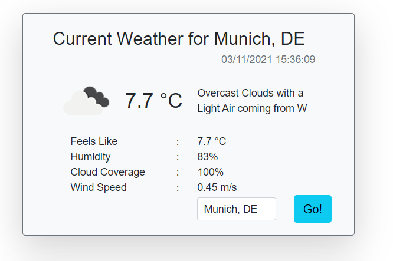

# Blazor.WeatherWidget
[](https://dev.azure.com/georgekosmidis/Blazor.WeatherWidget/_build/latest?definitionId=35&branchName=release) [](https://www.nuget.org/packages/Blazor.WeatherWidget) 

A simple component in Blazor that displays the current weather, featuring a default and a user defined template

Live Sample: https://blazor-weatherwidget.azurewebsites.net/
Nuget: https://www.nuget.org/packages/Blazor.WeatherWidget

## Default Template
Nothing much to do, just add a reference to the `Blazor.WeatherWidget` and then add the following code in your razor page:
```csharp
@using Blazor.WeatherWidget
<!-- ...  -->
<WeatherWidget CurrentCity="Munich, DE" />
<!-- ...  -->
```
By default the metric system will be used for all values. If you prefer the imperial system then use
```csharp
@using Blazor.WeatherWidget
<!-- ...  -->
<WeatherWidget CurrentCity="Munich, DE" Unit="imperial" />
<!-- ...  -->
```

> **Note**:
 The default template has a dependenxy on bootstrap, so if you want to use it, please add bootstap in your `_Host.cshtml`:

 ```html
<link rel="stylesheet" href="https://cdn.jsdelivr.net/npm/bootstrap@5.1.3/dist/css/bootstrap.min.css" />
 ```

The end result will be similar to this one:



## User Defined Template
(Thanks [@stavroskasidis](https://github.com/stavroskasidis))

You can create your own template and pass it on for parsing. Follows a sample that uses the basic properties:

### Sample Template

```csharp
<WeatherWidget CurrentCity="Munich, DE" Template="Models.WeatherWidgetTemplate.Custom">
    <CustomTemplate>
        <div class="card text-center">
            <div class="card-header">
                Weather for @context.CityName, @context.Sys.Country
            </div>
            <div class="card-body">
                
                <h5 class="card-title">@Math.Round(context.Main.Temperature, 1)&nbsp;°C</h5>
                <p class="card-text">@context.DateTimeLocal</p>
            </div>
            <div class="card-footer text-muted">
                @context.Weather[0].Description with @context.Wind.Description coming from @context.Wind.NamedDirection
            </div>
        </div>
    </CustomTemplate>
</WeatherWidget>
```
As with the default template, if you want imperical units, add this to the `WeatherWidget` tag: `Unit="imperial" `
 

### Available Properties
A user can create a custom template to consume all available properties:

*   `Coord`
    *   `Coord.Longitute` City geo location, longitude
    *   `Coord.Latitude` City geo location, latitude
*   `Weather` List of available updates. Position [0] holds the last update
    *   `Weather[0].Id` Weather condition id
    *   `Weather[0].Main` Group of weather parameters (Rain, Snow, Extreme etc.)
    *   `Weather[0].Description` Weather condition within the group.
    *   `Weather[0].Icon` Weather icon id, for custom icons
    *   `Weather[0].DefaultIcon` Weather icon URL    
*   `Base` Ignore, Internal Parameter    
*   `Main`
    *   `Main.Temperature` Temperature. Unit Default: Kelvin, Metric: Celsius, Imperial: Fahrenheit.
    *   `Main.FeelsLike` Temperature. This temperature parameter accounts for the human perception of weather. Unit Default: Kelvin, Metric: Celsius, Imperial: Fahrenheit.
    *   `Main.Pressure` Atmospheric pressure (on the sea level, if there is no sea_level or grnd_level data), hPa
    *   `Main.Humidity` Humidity, %
    *   `Main.TempMin` Minimum temperature at the moment. This is minimal currently observed temperature (within large megalopolises and urban areas). Unit Default: Kelvin, Metric: Celsius, Imperial: Fahrenheit.
    *   `Main.TempMax` Maximum temperature at the moment. This is maximal currently observed temperature (within large megalopolises and urban areas). Unit Default: Kelvin, Metric: Celsius, Imperial: Fahrenheit.
    *   `Main.SeaLevelPressure` Atmospheric pressure on the sea level, hPa
    *   `Main.GroundLevelPressure` Atmospheric pressure on the ground level, hPa
*   `Wind`
    *   `Wind.Speed` Wind speed. Unit Default: meter/sec, Metric: meter/sec, Imperial: miles/hour.
    *   `Wind.Degrees` Wind direction, degrees (meteorological)
    *   `Wind.Gusts` Wind gust. Unit Default: meter/sec, Metric: meter/sec, Imperial: miles/hour
    *   `Wind.Description` Description of the Wind speed
    *   `Wind.NamedDirection` Description of the Wind direction    
*   `Clouds`
    *   `Clouds.Coverage` Cloudiness, %
*   `Rain`
    *   `Rain.Volume1h` Rain volume for the last 1 hour, mm
    *   `Rain.Volume3h` Rain volume for the last 3 hours, mm
*   `Snow`
    *   `Snow.Volume1h` Snow volume for the last 1 hour, mm
    *   `Snow.Volume3h` Snow volume for the last 3 hours, mm
*   `SecondsSinceUnitTime` Time of data calculation, unix, UTC
*   `DateTimeUTC` DateTime of data calculation,  UTC
*   `DateTimeLocal` DateTime of data calculation, Local
*   `Timezone` Shift in seconds from UTC
*   `Sys`
    *   `Sys.Type` Internal parameter
    *   `Sys.Id` Internal parameter
    *   `Sys.Message` Internal parameter
    *   `Sys.Country` Country code (GB, JP etc.)
    *   `Sys.Sunrise` Sunrise time, unix, UTC
    *   `Sys.Sunset` Sunset time, unix, UTC
*   `id` City ID
*   `CityName` City name
*   `Cod` Ignore, Internal parameter

